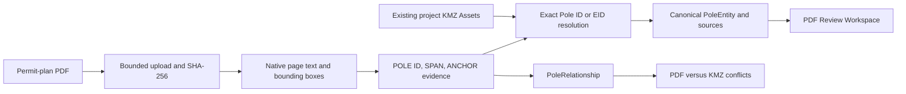
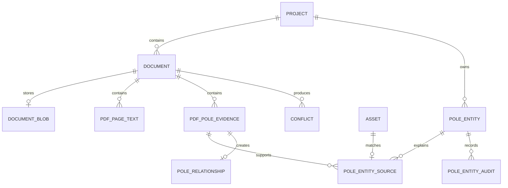

# PDF Pole Extraction

## Purpose and safety boundary

PDF Pole Extraction reads native text from an uploaded permit-plan PDF, records page-level evidence, and resolves pole identifiers against existing project assets. PDF evidence never creates map assets or coordinates. Geometry is available only when an evidence-derived pole entity is matched to an existing project Asset.

The feature does not perform OCR, execute PDF JavaScript, follow embedded links, extract attachments, or write PDF filenames or contents to the filesystem.

## Architecture



Extraction runs in a worker thread behind a request timeout. Database changes are committed only after extraction and evidence persistence succeed. A failed extraction marks the registered Document as `ERROR`; it does not create entities, relationships, conflicts, or Assets.

## Data model



Deleting a Document cascades to its blob, page text, evidence, PDF entity sources, relationships, and document-specific conflicts. Canonical PoleEntity and its audit history remain because an entity can aggregate sources from several documents or Assets. Deleting an Asset sets evidence and conflict Asset references to null; deleting a PoleEntity cascades its sources and audits and clears relationship/conflict entity references.

## API workflow

1. `POST /api/v1/pdf-pole-extractions/dry-run` with multipart `project_id` and `file`.
2. Inspect the returned counts and evidence, or use `GET /api/v1/pdf-pole-extractions/{document_id}/workspace`.
3. Optionally call `POST /api/v1/pdf-pole-extractions/{document_id}/resolve` to preview or persist exact resolution.
4. Confirm with `POST /api/v1/pdf-pole-extractions/{document_id}/commit` and a reviewer/reason.
5. Review exceptions through `GET /api/v1/review/pdf-items` and manual match/unmatch endpoints.
6. Call `POST /api/v1/pdf-pole-extractions/{document_id}/compare` to rebuild PDF/KMZ conflicts for that document.

Related read endpoints are `GET /api/v1/pole-entities`, `GET /api/v1/pole-relationships`, and `GET /api/v1/assets/{asset_id}/pdf-evidence`. All list and comparison queries are scoped to a project or to a Document/Asset that owns a project. UUID parameters are typed and invalid values return FastAPI validation errors.

## Dry-run and commit

Dry-run registers or reuses a Document by project-scoped SHA-256, stores the bounded PDF blob, replaces page/evidence rows, and reports findings. It creates no Asset, PoleEntity, PoleRelationship, or conflict. Repeating dry-run replaces derived evidence and removes its old source links rather than accumulating orphan rows.

Commit requires `confirmed: true`, `reviewer`, and `reason`. It creates or reuses canonical entities and relationships in one transaction. Unique constraints prevent duplicate canonical Pole IDs/EIDs, duplicate source links, duplicate Asset ownership, duplicate page numbers, duplicate blobs, and duplicate relationships for the same evidence. Repeating commit/resolve is idempotent.

Concurrent uploads for one project and concurrent manual matches for one Asset are serialized with database row locks. Database unique constraints remain the final race-condition guard.

## Entity resolution and manual review

Resolution is deliberately conservative:

- exact nine-digit Pole ID match;
- exact normalized EID match;
- one candidate becomes `RESOLVED`;
- more than one candidate becomes `AMBIGUOUS`;
- no candidate becomes `UNRESOLVED`;
- no fuzzy or name-similarity match;
- no coordinates are inferred from the PDF.

A reviewer can manually match an entity to an Asset in the same project or unmatch it. Both operations store reviewer, reason, before/after snapshots, and action in `pole_entity_audits`. Automatic resolve preserves `MANUAL` decisions. One Asset cannot belong to two pole entities.

## Conflict types

- `PDF_POLE_NOT_IN_KMZ`
- `KMZ_POLE_NOT_IN_PDF`
- `PDF_SPAN_TOPOLOGY_MISMATCH`
- `PDF_SPAN_LENGTH_MISMATCH`

Length mismatch uses the larger of 25 feet and 15 percent of designed length. Recompare replaces only these PDF conflict types for the selected Document and does not delete Sprint 5 `AERIAL_VS_UG` conflicts.

## Security and resource limits

- maximum upload: 50 MiB, read in 1 MiB chunks;
- required `.pdf` filename and `%PDF-` file signature;
- filename reduced to a printable basename and never used as a path;
- maximum 500 pages, 1,000,000 extracted words, and 50,000 evidence rows;
- extraction timeout: 180 seconds;
- page rendering timeout: 30 seconds;
- maximum rendered page area: 25,000,000 pixels;
- rendered response is PNG with private caching; the raw PDF blob has no download endpoint;
- raw text is returned as JSON and rendered by React text nodes, not injected HTML, preventing HTML execution;
- project filters are applied to Assets, Documents, entities, relationships, conflicts, and review queries.

TelecomOS currently has no authentication/authorization middleware. UUID/project scoping prevents accidental cross-project joins but is not an access-control boundary. Before multi-tenant production use, require an authenticated project membership dependency on every Document, page-rendering, entity, relationship, Asset evidence, and review endpoint.

Python thread cancellation cannot stop native parsing immediately after an HTTP timeout; limits constrain input, pages, words, and evidence, but production parsing should run in a killable background worker with CPU/memory quotas.

## Local operation

```bash
docker compose up -d --build
docker compose ps
curl -fsS http://localhost:8000/health
curl -fsS http://localhost:8000/api/v1/projects
```

Apply the additive migration after the Sprint 5 base schema exists:

```bash
docker compose exec -T db psql -U telecomos -d telecomos \
  < infrastructure/postgres/migrations/002_pdf_pole_extraction.sql
```

The migration is idempotent and should be applied twice in deployment validation.

## Tests and E2E

```bash
docker compose exec -T backend sh -lc 'PYTHONPATH=/app pytest -q && python -m compileall -q app tests'
docker compose exec -T frontend sh -lc 'npm test -- --run && npx tsc --noEmit && npm run build'
scripts/e2e_smoke.sh
scripts/pdf_entity_e2e.sh
```

The PDF E2E creates a small synthetic PDF and KML fixture. It verifies exact, ambiguous and unmatched resolution, span creation, manual match/unmatch, audit persistence, Asset evidence, conflict generation, and repeat-commit idempotency. User documents are not test fixtures and must never be committed.

## Rollback notes

Migration 002 is additive. The safe operational rollback is to deploy the previous application version while leaving the added nullable conflict columns and PDF tables in place. They are inert for the previous application.

A destructive rollback must be separately reviewed, backed up, and run manually. Delete PDF conflict rows first, drop the added conflict foreign keys/columns, then drop `pole_relationships`, `pole_entity_audits`, `pole_entity_sources`, `pole_entities`, `pdf_pole_evidence`, `pdf_page_texts`, and `document_blobs` in dependency order. Do not automate this rollback because it permanently removes reviewer decisions and extracted evidence.

## Known limitations and production recommendations

- native-text PDFs only; scanned plans require a separately reviewed OCR pipeline;
- the PDF blob is stored in PostgreSQL `BYTEA`; use encrypted object storage and retention policies in production;
- extraction is request-bound; use a queue worker with hard process limits for large plans;
- workspace resolution filtering and Review Queue assembly are bounded but partially performed in application memory; move them to SQL/materialized views for very large projects;
- page PNGs are generated on demand and not shared-cached;
- add authentication, project-level authorization, audit identity from the authenticated principal, malware scanning, metrics, and structured extraction error logging before multi-tenant production deployment.
