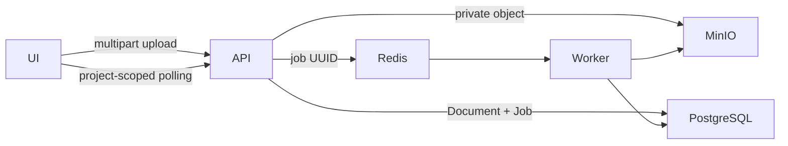

# PDF object storage and processing jobs

## Architecture

PDF uploads are validated and hashed while bounded by `MAX_PDF_SIZE`. TelecomOS creates or reuses a project-scoped `Document`, uploads the original PDF to the private MinIO bucket, stores only object metadata on `documents`, commits a durable `pdf_processing_jobs` row, and then publishes its UUID to Redis. The worker downloads the object, verifies size, signature and SHA-256, extracts native text/evidence, renders pages to private objects, resolves pole entities, and compares PDF evidence with KMZ assets.



No public bucket policy or public object URL is used. Page responses are streamed through the project-scoped API. The storage service supports short-lived presigned URLs (30–900 seconds) for future internal use, but URLs are never persisted or logged.

## Data model and migration

Migration `003_pdf_object_storage_jobs.sql` adds storage metadata to `documents`, the durable job table, rendered-page metadata, foreign keys, uniqueness constraints and query indexes. It is additive and idempotent. Existing `document_blobs` rows remain readable.

Run the schema migration through the normal Compose startup, or explicitly twice to validate idempotency:

```bash
docker compose exec -T db psql -U telecomos -d telecomos < infrastructure/postgres/migrations/003_pdf_object_storage_jobs.sql
docker compose exec -T db psql -U telecomos -d telecomos < infrastructure/postgres/migrations/003_pdf_object_storage_jobs.sql
```

Copy and verify legacy BYTEA without deleting it:

```bash
docker compose exec backend python /workspace/scripts/migrate_pdf_blobs.py
```

After reviewing a zero-failure report, deletion is a separate explicit operation:

```bash
docker compose exec backend python /workspace/scripts/migrate_pdf_blobs.py --clear-bytea
```

Production rollback is application-first: deploy the previous application while retaining the new nullable columns/tables and legacy BYTEA. Do not automatically drop objects, columns, tables, or BYTEA. Restore object metadata from backup before any later destructive schema rollback.

## API workflow

- `POST /api/v1/pdf-jobs` — multipart `project_id`, `file`; returns HTTP 202 and a job. Duplicate `(project_id, SHA-256, FULL_PIPELINE)` requests reuse the Document, object and job.
- `GET /api/v1/pdf-jobs/{job_id}?project_id=<uuid>` — project-scoped job status.
- `GET /api/v1/pdf-jobs?project_id=<uuid>&offset=0&limit=50` — paginated history.
- `POST /api/v1/pdf-jobs/{job_id}/cancel?project_id=<uuid>` — cooperative cancellation.
- `POST /api/v1/pdf-jobs/{job_id}/retry?project_id=<uuid>` — bounded retry for FAILED/CANCELLED jobs.
- `GET /api/v1/documents/{document_id}/page/{page}.png?project_id=<uuid>` — private rendered page with legacy BYTEA fallback.

Small files remain compatible with `POST /api/v1/pdf-pole-extractions/dry-run`. Files at or above `PDF_BACKGROUND_SIZE_THRESHOLD_BYTES` or `PDF_BACKGROUND_PAGE_THRESHOLD` return HTTP 202 with the job contract.

## Job state machine

`QUEUED → RUNNING → SUCCEEDED`; terminal alternatives are `FAILED` and `CANCELLED`. Retry moves `FAILED/CANCELLED → QUEUED` while `attempts < max_attempts`. Progress is monotonic within an attempt and stages are `DOWNLOADING`, `EXTRACTING`, `PERSISTING`, `RENDERING`, `RESOLVING`, `COMPARING`, `COMPLETE`. A cancellation request is checked between stages and periodically during rendering.

The worker heartbeats in Redis and each RUNNING job stores `heartbeat_at`. On startup and while idle, stale RUNNING jobs are locked with `SKIP LOCKED` and either requeued or failed after the retry ceiling. Database transactions do not span extraction, rendering, or MinIO network operations.

## Security and resource limits

- PDF signature, upload size, downloaded size and SHA-256 are validated.
- Object keys contain generated UUIDs and a digest, never filenames or user paths.
- Filenames are basename-normalized for display only.
- Bucket policy is private; content and presigned URLs must not appear in logs.
- Extraction page/word/evidence, rendering pixel, request-size, timeout and retry limits are configurable.
- API lookups require project UUID scoping. Authentication/authorization is not yet present in Sprint 5; production must derive project access from an authenticated principal rather than trusting a query parameter.
- React renders `raw_text` as escaped text; no HTML injection API is used.

## Operations

```bash
docker compose up -d --build --wait
docker compose ps
docker compose logs -f worker
docker compose exec redis redis-cli LLEN telecomos:pdf-jobs
docker compose exec redis redis-cli GET telecomos:pdf-worker:heartbeat
curl 'http://127.0.0.1:8000/api/v1/pdf-jobs?project_id=<uuid>'
docker compose exec backend python /workspace/scripts/migrate_pdf_blobs.py --cleanup-orphans
docker compose exec backend python /workspace/scripts/migrate_pdf_blobs.py --apply-orphan-cleanup
./scripts/background_pdf_e2e.sh
```

Retain failed job metadata for 30 days and rendered pages for 7 days by default. Orphan reconciliation is dry-run by default, considers both Document and rendered-page references, and uses a one-hour grace period to avoid racing an in-flight upload; deletion requires `--apply-orphan-cleanup`. Production should schedule retention cleanup and reconciliation according to policy. Metrics should include queue depth, state counts, stage duration, attempts, stale recovery and orphan cleanup counts—never filenames, extracted text, document bytes, credentials, or signed URLs.

## Known limitations and production recommendations

- Redis lists provide a compact Sprint 5 queue; production should consider a managed durable queue with visibility timeouts and dead-letter support.
- Cancellation is cooperative and cannot interrupt a single native PDF parser call.
- Rendered-page retention cleanup is documented but not automatically scheduled in this change.
- MinIO credentials shown in Compose are local-development defaults; use secret management, TLS, bucket versioning, encryption, lifecycle rules, audit logging and least-privilege service accounts in production.
- Add authenticated project membership enforcement, malware scanning, rate limiting, quotas, tracing and storage reconciliation alerts before internet exposure.
